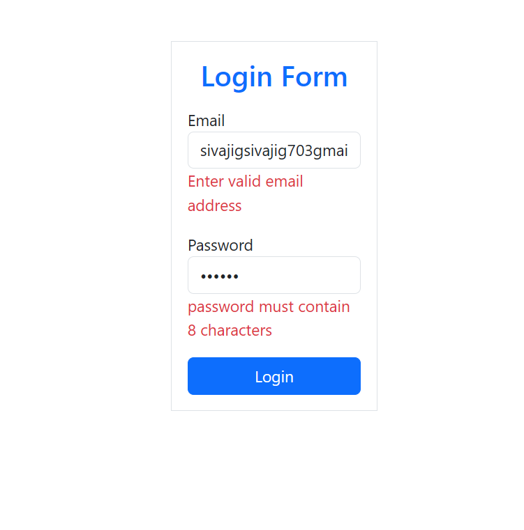

# react-projects-practice
<h2>project number:1</h2>
<h2>Expense-tracker</h2>
<h4>ScreenShot</h4>

<h2>Form Handling</h2>
<h4>ScreenShot</h4>

<h2>Form Validation</h2>
<h4>ScreenShot</h4>

## more projects are being uploaded in a while 
now focusing on building full stack apps 